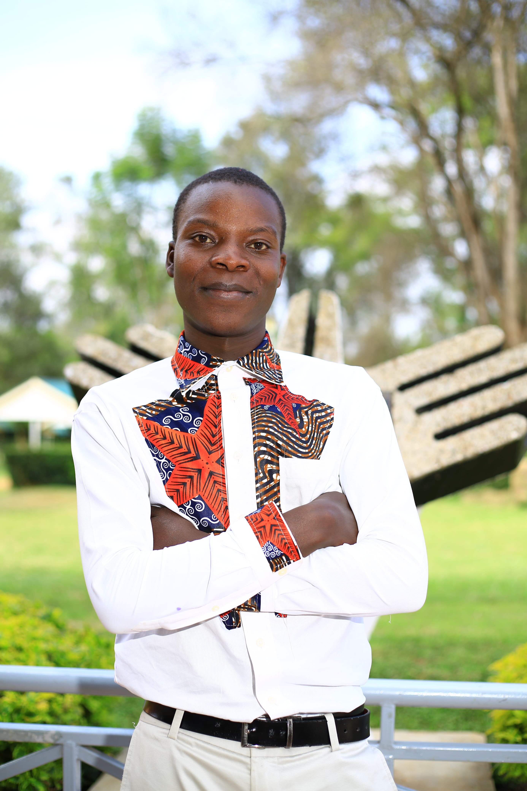

  

  

 

<table align="center" border="0" cellpadding="0" cellspacing="0">
  <tr>
    <td valign="top" width="280">
      
    </td>
    <td valign="top" style="padding-left: 30px;">
      <h1>Ramspheld Onyango Ochieng</h1>
      

        🚀 <b>AI Engineer · Full Stack Developer · Sustainability Advocate</b> 
        🌍 <i>Passionate about building inclusive, AI-powered solutions for digital equity and climate resilience in Africa.</i>
      

       
      
        
      
    </td>
  </tr>
</table>

 

---

### � Tech Stack & Expertise

  
  <table>
    <tr>
      <td align="center" width="200"><b>Languages</b></td>
      <td align="center" width="200"><b>Frontend</b></td>
      <td align="center" width="200"><b>Backend & AI</b></td>
      <td align="center" width="200"><b>DevOps & Tools</b></td>
    </tr>
    <tr>
      <td align="center">
        
      </td>
      <td align="center">
        
      </td>
      <td align="center">
        
      </td>
      <td align="center">
        
      </td>
    </tr>
  </table>

---

### 🚀 Activity & Achievement Highlights

  

  

---

### 🕒 Latest GitHub Activity
<!-- START_SECTION:activity -->
*Currently fetching my latest moves on GitHub...*
<!-- END_SECTION:activity -->

---

### ⚡ Connect with Me

  I love combining AI and technology to build solutions that scale impact. 🌍
    
  
  
  

  

